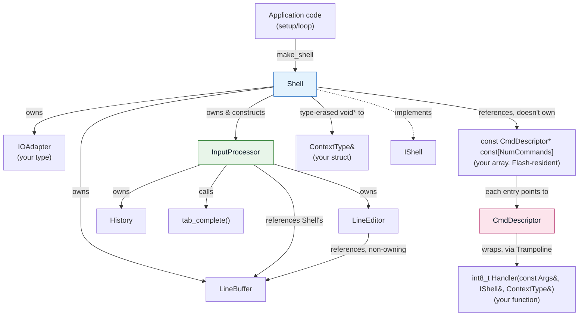
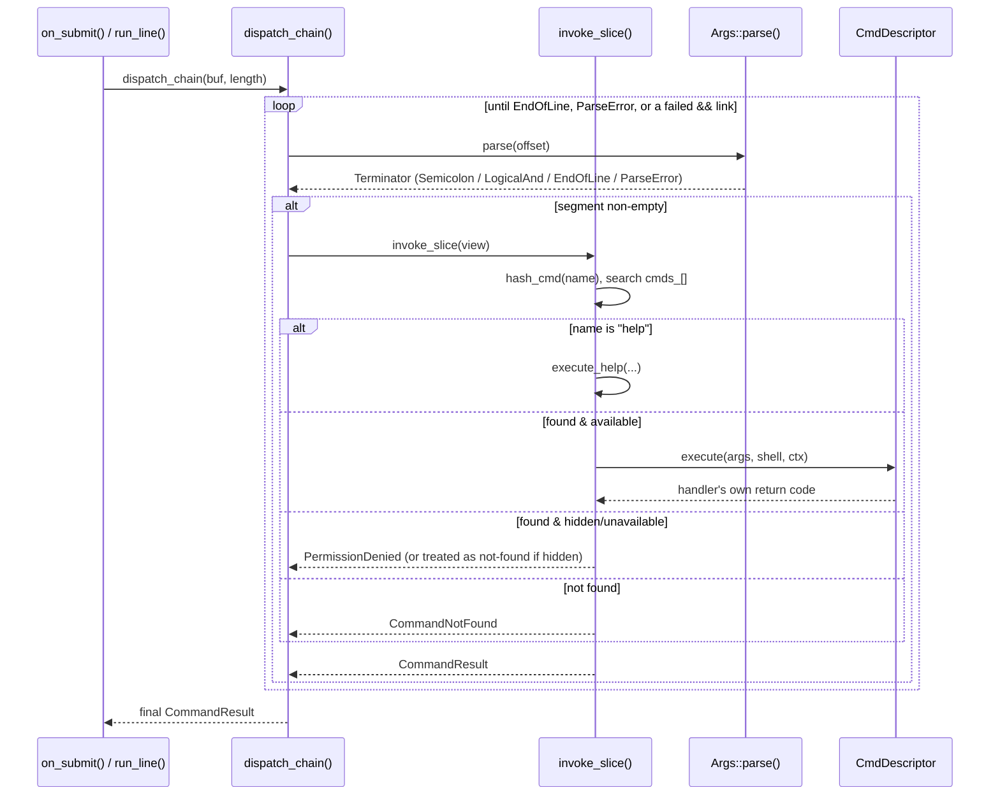

  

# Architecture

This is an internals primer for contributors - it's not needed to *use*
LiSh (see [Getting Started](GETTING_STARTED.md) for that). Everything
below is drawn directly from the current source in `src/` and the
`examples/BasicShell` reference implementation, not from design notes -
where behavior is subtle, the relevant file is named so you can go read it
yourself.

## Overview

LiSh is built as a small set of independent, mostly non-templated or
lightly-templated pieces, composed together by one class, `Shell`, which is
the only piece that owns everything and the only one application code
touches directly (through the `IShell` interface it implements). Two
dispatch paths exist side by side:

- **Interactive** (`service()`) - bytes arrive one at a time from the
  `IOAdapter`, get fed through `InputProcessor` (editing, history, tab
  completion), and on Enter, the completed line is dispatched and its
  status printed.
- **Non-interactive** (`run_line()`) - a caller-supplied line is dispatched
  directly, with no line editor involved and no status line printed. Safe
  to call reentrantly from inside a command handler that already has an
  `IShell&` - see `examples/BasicShell/cmd_sudo.cpp`, which re-dispatches a
  reconstructed line at an elevated permission mode.

Both paths funnel through the same two private `Shell` methods,
`dispatch_chain()` and `invoke_slice()` (see [Command Dispatch](#command-dispatch)).

## Component Map

| File | Provides | Templated? |
|---|---|---|
| `lishShell.h`/`.ipp` | `Shell` - owns everything, implements `IShell` | Yes (8 params) |
| `lishIShell.h` | `IShell` - the only virtual interface in the library | No |
| `lishInputProcessor.h`/`.ipp` | `InputProcessor` - character-level editing state machine | Yes |
| `lishLineBuffer.h` | `LineBuffer<N>` - buffer + cursor + length, one unit | Yes |
| `lishLineEditor.h` | `LineEditor<N>` - stateless insert/delete/move ops on a `LineBuffer` | Yes |
| `lishHistory.h` | `History<Length, TypicalLen>` - fixed-buffer command history with dedup | Yes |
| `lishTabComplete.h`/`.cpp` | `tab_complete()` - free function, single/multi-match completion | Partly (entry point is a template; helpers aren't) |
| `lishCmdDescriptor.h`/`.cpp` | `CmdDescriptor` - one command's compile-time metadata + trampoline | No (factory `make()` is) |
| `lishCmdPermission.h` | `CmdPermission` - the 7-mode + visibility-flag bitmask, and its predicates | No |
| `lishHelp.h` | `execute_help()` - the built-in `help` command (not a real `CmdDescriptor`) | Yes |
| `lishArgs.h`/`.cpp` | `Args` - in-place tokenizer/view over a line buffer | No |
| `lishResult.h` | `ShellStatus`, `CommandResult` | No |
| `lishPlatform.h` | `LISH_PROGMEM`/`LISH_FLASH_STORAGE`, `read_flash<T>()`, `write_string()`/`write_flash_string()` | Some helpers |
| `lishDefs.h` | `hash_cmd()`, `unused()`, shared Flash-resident UI strings (ANSI codes, `NEWLINE`, status messages) | No |
| `lish.h` | `make_shell()` - the aggregating header + factory function | Yes |

## Composition

A few relationships worth calling out explicitly, since they're easy to get
wrong by guessing:

- `Shell` does **not** hand `InputProcessor` a copy of anything - both
  reference the same `LineBuffer` instance, `cmds_` array, and
  `current_mode_`. `InputProcessor` also holds an `IShell&` back to the
  `Shell` that owns it, used only to call `print_prompt()` during redraws.
- `CmdDescriptor` is not a class template. What's templated is its `make()`
  factory (on `ContextType` and the handler function pointer) and the
  private `Trampoline<ContextType, Handler>` it generates - the descriptor
  object itself is always the same concrete, non-templated type, which is
  what lets an array of them exist at all (`const CmdDescriptor* const[]`)
  despite every command's handler having a different `ContextType` in
  general (in practice, one `Shell` instance's commands all share one
  `ContextType`, but nothing about `CmdDescriptor`'s own layout depends on
  that).
- The built-in `help` command has no `CmdDescriptor` at all - `lishHelp.h`'s
  `execute_help()` is called directly by name/hash special-casing in
  `Shell::invoke_slice()`, `tab_complete()`, and `execute_help()` itself
  (for `help help`). See `HELP_COMMAND_STR` in `lishDefs.h`.

## Command Dispatch

Both `service()` (via `on_submit()`) and `run_line()` call the same private
pipeline once a complete line is in hand:

Points that aren't obvious from the code's shape alone:

- **Chaining is incremental, not two-phase.** Each segment is parsed, then
  immediately executed, before the next segment is even parsed - by the
  time segment 3 is parsed, segments 1 and 2 have already run. `;` always
  continues to the next segment regardless of outcome; `&&` continues only
  if `result.succeeded()` (both `status == Ok` **and** `code == 0` - see
  `CommandResult::succeeded()` in `lishResult.h`).
- **A parse error halts the whole chain immediately**, including segments
  after it that were never even reached - there's no attempt to
  resynchronize past an unclosed quote, since the parser can't reliably
  guess where a "next command" would begin from that point on.
- **A hidden command and a genuinely absent one are indistinguishable to
  the caller** - both report `CommandNotFound`. This is deliberate:
  `is_hidden()` exists specifically so a restricted command doesn't leak
  its own existence to `help` listings or a "command not found" vs
  "permission denied" distinction.
- **`run_line()` and the interactive path diverge on empty input.** A
  zero-length line passed to `run_line()` short-circuits to
  `ShellStatus::EmptyCommand` without calling `dispatch_chain()` at all.
  The interactive path never produces `EmptyCommand`: `on_submit()` checks
  `line_buf_.is_blank()` (empty *or all-whitespace*) and skips dispatch
  entirely for a blank line - so `run_line()`'s `EmptyCommand` case can
  never arise from typing at the prompt, only from a caller passing an
  explicitly zero-length line.
- **Status is only ever printed once per line, not once per command.**
  `print_status()` is called exactly once by `on_submit()`, after the whole
  chain (however many segments it contained) has finished.
- **Every status line is machine-parseable, not just human-readable.**
  `print_status()` prefixes its message with a single ASCII control byte -
  ACK (`0x06`) for a fully successful result, NAK (`0x15`) for any failure
  (a nonzero return code, command not found, or permission denied) - always
  as the first byte after the blank line it writes first. An automated
  caller (a test harness, production tooling) can classify a result by
  checking that one fixed-position byte, without string-matching the
  bracketed text that follows it. See `STATUS_OK`/`STATUS_ERROR_PREFIX` in
  `lishDefs.h`.

## Interactive Input Pipeline

`InputProcessor::process_char()` is a small state machine
(`AnsiState::{Idle, Escape, Csi, Ss3}`) that classifies each incoming byte:

| Input | Effect |
|---|---|
| `\r` or `\n` (with CR/LF-pair dedup) | Line ready: exits history browsing, pushes to history (if non-blank), returns `true` |
| `0x20`-`0x7E` (printable) | `handle_insert()` |
| `\b` / `0x7F` | `handle_backspace()` |
| `\t` | `handle_tab_complete()` |
| `ESC [ A` / `ESC O A` | `handle_history_prev()` |
| `ESC [ B` / `ESC O B` | `handle_history_next()` |
| `ESC [ C` / `ESC O C` | `handle_right()` |
| `ESC [ D` / `ESC O D` | `handle_left()` |
| `ESC [ 1~` / `ESC [ 7~` / `ESC O H` | `handle_home()` |
| `ESC [ 4~` / `ESC [ 8~` / `ESC O F` | `handle_end()` |
| `ESC [ 3~` | `handle_delete()` |

(See `handle_ansi_or_special()` in `lishInputProcessor.ipp` for the exact
state transitions - `ansi_param_` only ever retains the single
most-recently-typed digit of a CSI numeric parameter, which is why a
hypothetical two-digit code isn't handled correctly today; every code
currently recognized happens to be one digit.)

**History browsing is deliberately non-destructive to the live line
buffer.** While `history_.is_browsing()` is true, the browsed entry is
written straight to the `IOAdapter` by `clear_line_and_redraw_history()` -
`line_buf_` itself isn't touched until browsing ends (any edit, or
pressing Enter), via `exit_browsing_and_copy()`. This is why you can
up-arrow through history, then press Escape-equivalent (any edit key) and
land back on whatever you'd been typing before you started browsing, not
on a mutated version of a history entry.

**Redraws are targeted, not full-line, for insert/delete/arrow
operations** (`partial_redraw_from()`) - only tab completion and exiting
history browsing trigger a full `clear_line_and_redraw()`. This is purely
a terminal-flicker optimization; it doesn't affect `LineBuffer` state.

## Permission System

`CmdPermission` is a `uint8_t` bitmask: bits 0-6 are seven independent,
application-defined "modes" (`Mode0`...`Mode6`), bit 7 is a single
`HideWhenUnavailable` flag. Two predicates in `lishCmdPermission.h` do all
the work:

- **`is_available(perm, current_mode)`** - `true` if `perm`'s mode bits and
  `current_mode` overlap at all. `current_mode` must be a single active
  bit (never a combined mask) - this precondition is load-bearing
  throughout the library (`IShell`, `Shell`, `CmdDescriptor`, `tab_complete()`
  all document and rely on it).
- **`is_hidden(perm, current_mode)`** - `true` only if `HideWhenUnavailable`
  is set **and** the command isn't available. This governs `help` listings
  only: an unavailable command without the flag is still listed, just
  dimmed (`ANSI_DIM`). **Tab completion never calls `is_hidden()` at all** -
  it filters purely on `available()`, so an unavailable command is always
  excluded from completion candidates regardless of the flag.

## History

`History<HistoryLength, TypicalLineLength>` stores entries as
null-terminated strings packed sequentially into one
`HistoryLength * TypicalLineLength`-byte buffer, newest-first at offset 0.
`push()` handles three cases, in order: the incoming line is identical to
the current front entry (no-op besides exiting browsing mode);
case-insensitively equal to some other existing entry (moved to the front
via a single shift of only the newer entries, not a remove-then-reinsert);
or genuinely new (prepended, evicting the oldest entries first if needed to
make room). Browsing state (`cursor_`) is independent of the write path -
`cursor_ == HistoryLength` means "not browsing."

## Tab Completion

`tab_complete()` (`lishTabComplete.h`) extracts the partial command at the
cursor, then checks it against every `available()` command (the built-in
`help` included) in one pass:

- **Zero matches** - does nothing, returns `false` (no redraw needed).
- **Exactly one match** - completed in place, a trailing space appended,
  cursor moved past it.
- **More than one match** - the buffer is left untouched; every matching
  name is written to the `IOAdapter`, one per line, for the caller to
  redraw around.

Candidates are filtered by `available()` only, never `hidden()` - see
[Permission System](#permission-system) above for why that's a deliberate
difference from `help`.

## Flash/PROGMEM Storage

Two macros in `lishPlatform.h`, guarded by `#ifndef` (so a target can
override either before including the header), select the strategy:

- **AVR** (`__AVR__` defined): `LISH_PROGMEM` expands to `PROGMEM`,
  `LISH_FLASH_STORAGE` to `const`. Reading such data requires
  `read_flash<T>()` (→ `memcpy_P()`) rather than a direct dereference,
  since AVR is Harvard-architecture (Flash and RAM are different address
  spaces).
- **Everything else** (unified address space - ARM, x86, etc.):
  `LISH_PROGMEM` is a no-op, `LISH_FLASH_STORAGE` becomes
  `constexpr const`, and `read_flash<T>()` is a plain dereference.

Every command's name string, help string, and the `CmdDescriptor` itself
(and the array of pointers to them) MUST be declared with these macros on
AVR - see `examples/BasicShell/cmd_echo.cpp` for the pattern. This is not
just a Flash-vs-RAM footprint trade-off: `CmdDescriptor`'s accessors
(`name()`, `help()`, `execute()`, `matches_hash()`) call `read_flash<T>()`
unconditionally, regardless of where the data actually lives. On AVR, that
means a `memcpy_P()`/Flash-load instruction fires no matter what - so a
descriptor or string left in plain RAM doesn't "still work" using more RAM
instead; the address is reinterpreted as a Flash address in that separate
Harvard-architecture address space and read from there, producing garbled
command names, help text, or lookups. Nothing in the library enforces the
macros at compile time, and the bug is invisible on unified-address-space
targets (ARM, x86, this repo's own host tests) - it only shows up once you
flash real AVR hardware.

## Extending

- **Adding a command**: write a handler function, build a `CmdDescriptor`
  for it via `CmdDescriptor::make<YourContextType, &handler>(...)`, add a
  pointer to it to your command array. See
  [Getting Started §2-3](GETTING_STARTED.md#2-writing-a-command) for the
  full walkthrough, or `examples/BasicShell/shell_config.h` for a working
  multi-command table.
- **Writing a custom `IOAdapter`**: implement `write(char)` and
  `read(char&, uint16_t timeout_ms = 0)` honoring the three timeout cases
  documented on `IShell::read()`. See
  [Getting Started §1](GETTING_STARTED.md#1-the-io-adapter).
- **A command that needs to run another command line** (elevated
  privilege, an alias, a macro): call `shell.run_line(...)` reentrantly
  from within a handler - see `examples/BasicShell/cmd_sudo.cpp`.
